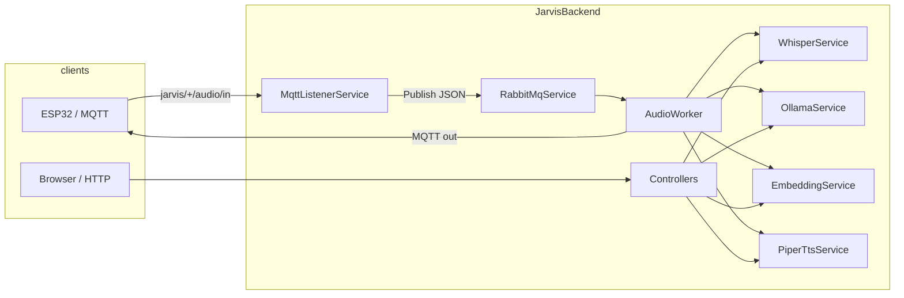

# Jarvis Backend — Architecture, Flow, and Response-Time Analysis

This document describes how the **JarvisBackend** (.NET 8) application is structured, how requests and background jobs flow through it, what dominates **latency**, and **concrete improvements** you can make. It is derived from the current code under `Backend/`.

---

## 1. High-level architecture

The backend is a single ASP.NET Core host that combines:

| Layer | Responsibility |
|--------|----------------|
| **HTTP API** | Controllers under `api/*` for chat history, knowledge (RAG), voice (STT/LLM/TTS), and roles |
| **Static files** | `UseDefaultFiles` + `UseStaticFiles` (serves the frontend from the same origin when deployed together) |
| **Background services** | MQTT listener, RabbitMQ consumer (`AudioWorker`), reminder writer (`ReminderWorker`) |
| **External processes** | Whisper (Python script), Piper TTS (`piper.exe`) |
| **External HTTP** | Ollama (`/api/generate`, `/api/embed`) |
| **Data stores** | MongoDB (memory + knowledge + roles), Redis (recent turns, embedding cache, LLM cache, role mode) |
| **Message bus** | RabbitMQ queue `audio_queue` between MQTT ingest and the audio pipeline |

---

## 2. Application startup (`Program.cs`)

1. **Kestrel** binds to `http://0.0.0.0:5000` (hardcoded; `Server:Host` / `Server:Port` in config are logged but not applied to `UseUrls` — see improvements).
2. **Serilog** request logging is enabled.
3. **CORS** default policy allows any origin/method/header.
4. **Singletons / hosted services**:
   - `RabbitMqService`, `RedisService`, `MqttListenerService`, `AudioWorker`
   - `WhisperService`, `PiperTtsService`, `MongoService`, `MemoryService`, `KnowledgeService`, `EmbeddingService` (typed `HttpClient`), `OllamaService` (typed `HttpClient`)
   - `Channel<ReminderItem>` + `ReminderWorker` + `ReminderService`
5. **Controllers** mapped via `MapControllers()`; no minimal APIs in use.

---

## 3. Request and pipeline flows

### 3.1 ESP32 / MQTT → RabbitMQ → `AudioWorker` (main voice assistant path)

**Ingress**

1. `MqttListenerService` connects to the MQTT broker and subscribes to:
   - `jarvis/+/audio/in` — binary audio payload
   - `jarvis/+/mode` — text payload (role key, e.g. `ironman`)
2. For **audio**: wraps payload in `AudioMessage` (`ClientId` from topic segment) and calls `RabbitMqService.Publish` (JSON body to the queue).
3. For **mode**: stores role in Redis via `SetRoleAsync`.

**Processing (`AudioWorker`)**

1. Consumer uses **manual ack**, **prefetch = 1** (only one unacked message at a time per consumer).
2. Received messages are **decoded → temp WAV** and enqueued to an in-memory `Channel`; a **dedicated ack loop** calls `BasicAck` (RabbitMQ `IModel` is not thread-safe — this design avoids cross-thread channel use).
3. **Processor loop** runs the heavy pipeline per message:

   - If file smaller than ~32 KB: skip Whisper/LLM/RAG; short TTS reply.
   - Else:
     1. **Whisper** (`TranscribeAsync`) — external Python.
     2. **Profile facts** — regex extraction → `IProfileService` (Redis).
     3. **Embedding** — `IEmbeddingService.GetEmbedding` (Ollama + Redis cache).
     4. **Parallel fetch** (`Task.WhenAll`): recent memory, similar memory (vector search in app), optional **knowledge RAG** context.
     5. **Profile** + **role** from Redis/Mongo → `PromptBuilder.Build`.
     6. **LLM** — optional **Redis LLM cache** (keyed by client + hash of user text); on miss, `OllamaService.GenerateAsync`.
     7. **Persist** — `IMemory.Save` (Mongo + Redis recent list).
     8. **Reminder channel** — enqueue for `ReminderWorker`.
     9. **TTS** — Piper → strip WAV header → **MQTT publish** (JSON + raw PCM/WAV bytes on `.../wav`).

**End-to-end latency (user-perceived on device)** is dominated by: **Whisper + Ollama + Piper + MQTT round-trip**, not by HTTP.

---

### 3.2 HTTP: `POST /api/voice/ask` (multipart audio → WAV response)

**Flow (strictly sequential)**

1. Save upload to `audio/input/{guid}.wav`.
2. Whisper → Ollama (persona from `Assistant:*` config) → Piper → `File(bytes, "audio/wav")`.

**Differences from MQTT pipeline**

- No Mongo/Redis memory, no knowledge RAG, no role from Redis, no LLM cache.
- Every call hits disk for the upload.

**Latency**: same order as **STT + LLM + TTS**; typically **multi-second** on a local stack.

---

### 3.3 HTTP: `POST /api/voice/stt`

Multipart upload → disk (`input.wav`) → Whisper → JSON `{ text }`.

---

### 3.4 HTTP: Knowledge / RAG (`KnowledgeController`)

| Endpoint | Flow |
|----------|------|
| `POST /api/knowledge` | Chunk text → **per-chunk** `GetEmbedding` → insert Mongo documents |
| `GET /api/knowledge` | `Find all` knowledge docs (full scan from DB) |
| `POST /api/knowledge/ask` | Embed question → build prompt (knowledge + **memory** for `ClientId`) → Ollama generate → save turn to memory |
| `POST /api/knowledge/ask/stream` | Same prep, then **SSE** token stream from Ollama; save turn after stream completes |

**Perceived latency**

- **Non-streaming**: embedding + Mongo reads + Ollama (largest chunk).
- **Streaming**: time-to-first-token is better for UX; total time similar.

---

### 3.5 HTTP: `GET /api/chat/history`

Loads recent conversation from `IMemoryService.GetRecent` (Mongo, sorted by time).

---

### 3.6 HTTP: `api/roles`

CRUD-style: Mongo via `IRoleService`.

---

### 3.7 `ReminderWorker`

Async consumer from `Channel<ReminderItem>`; persists turns through `IReminderService` for downstream use (does not block the main LLM path except for a cheap channel write).

---

## 4. What drives response time (ordered by typical impact)

### 4.1 Ollama (LLM generation)

- All meaningful “assistant” latency includes **`POST .../api/generate`**.
- Config: `Ollama:Model`, `NumPredict`, `Temperature`, etc. Larger models and higher `num_predict` **directly increase** latency.
- **Mitigations already in code**: Redis **LLM cache** in `AudioWorker` only (not in `VoiceController` or `/api/knowledge/ask`).

### 4.2 Whisper (Python subprocess)

- `WhisperService` runs `python whisper_script.py <wav>` via `ProcessHelper.RunProcess`.
- Cost: **process spawn + model load (if not resident) + inference**. This is often **comparable to or larger than** a short LLM call on CPU.

### 4.3 Piper TTS (external `piper.exe`)

- Spawns process, writes WAV, reads bytes. Scales with **text length** and CPU.

### 4.4 Embeddings (`EmbeddingService`)

- `POST /api/embed` to Ollama.
- **Mitigation**: Redis cache keyed by hash of normalized text (`EmbeddingCacheTtlSeconds`).

### 4.5 MongoDB access patterns (important for scale)

**Knowledge search** (`KnowledgeService.SearchScoredAsync`):

- Loads **all** knowledge documents with `Find(_ => true).ToListAsync()`, then computes **cosine similarity in memory** and takes top-N.

**Memory search** (`MemoryService.Search`):

- Loads **all** `ChatMemory` documents for the client (or entire collection if no filter), same in-memory cosine pattern.

As collections grow, **latency and RAM** grow **linearly** with document count. For small demos this is fine; for production it becomes the bottleneck.

### 4.6 Network and brokers

- MQTT publish after pipeline completion.
- RabbitMQ with **prefetch 1** → **at most one** audio job fully processed at a time per consumer instance (good for stability, limits throughput).

### 4.7 Synchronous blocking in MQTT handler

In `MqttListenerService.OnMessageReceived`, role updates use:

`SetRoleAsync(...).GetAwaiter().GetResult()`

That **blocks a thread** while waiting on Redis. Under load, this can reduce scalability and cause thread-pool contention.

---

## 5. Strengths (already good for latency or reliability)

1. **AudioWorker** decouples RabbitMQ receive from heavy work; **ack** is serialized on one loop.
2. **Prefetch 1** avoids piling up unprocessed messages.
3. **Redis** caches embeddings and (in the worker) LLM replies.
4. **RAG + memory** in the worker uses **`Task.WhenAll`** for memory/knowledge fetches where applicable.
5. **Knowledge ask/stream** exposes **SSE** for progressive UI.
6. **Typed `HttpClient`** for Ollama/embedding avoids socket exhaustion.

---

## 6. Recommended improvements

### Priority A — highest impact

1. **Vector search in the database**  
   Replace full collection scans with:
   - MongoDB Atlas Vector Search, or  
   - A dedicated vector DB (Qdrant, pgvector, etc.), or  
   - At minimum: store embeddings in a structure that supports **approximate** search (IVF, HNSW) via a sidecar.  
   **Goal**: retrieval time **sub-linear** in corpus size.

2. **Batch or pipeline embeddings for `SaveWithEmbeddingAsync`**  
   Today each chunk calls `GetEmbedding` sequentially. If Ollama supports batch embed for your client version, batch chunks to reduce round-trips.

3. **Remove `.GetResult()` in MQTT**  
   Make `OnMessageReceived` properly `async` and `await SetRoleAsync`, or post work to `Channel`/background queue, so the MQTT thread never blocks.

4. **Align HTTP voice with MQTT capabilities (optional product decision)**  
   If `/api/voice/ask` should feel like the toy: add memory + optional RAG + LLM cache, or document that it is a **lightweight** path only.

### Priority B — medium impact

5. **Whisper as a long-lived service**  
   Keep a **resident** Whisper server (HTTP/gRPC) or reuse one Python process to avoid **per-request cold starts**.

6. **Streaming TTS**  
   For web clients, stream audio chunks instead of waiting for full WAV (larger change).

7. **Use `Server:Port` / `Server:Host` in `WebApplication`**  
   Today `UseUrls("http://0.0.0.0:5000")` overrides config expectations; either read from configuration or document the override.

8. **Cancellation tokens**  
   Pass `CancellationToken` through `EmbeddingService.GetEmbedding` and `WhisperService.TranscribeAsync` so disconnecting clients stop work.

9. **Durable RabbitMQ messages**  
   If you cannot lose audio jobs on broker restart, use **durable queues** and **persistent messages** (with a matching consumer pattern).

### Priority C — observability and tuning

10. **Structured timing logs**  
    Log phases: `stt_ms`, `embed_ms`, `rag_ms`, `llm_ms`, `tts_ms`, `mqtt_ms` (one line per job) for evidence-based tuning.

11. **Horizontal scaling**  
    Multiple backend instances need **shared** Redis/Mongo/MQTT and either **competing consumers** on the same queue (multiple `AudioWorker` instances) or **partitioned** queues — design ack/idempotency accordingly.

12. **Rate limits / payload limits**  
    Protect `multipart` endpoints and MQTT ingress from huge uploads.

---

## 7. Configuration knobs that affect latency

| Area | Keys (see `appsettings.json`) | Effect |
|------|--------------------------------|--------|
| LLM | `Ollama:Model`, `Ollama:NumPredict`, `Knowledge:NumPredict` | Larger model / more tokens → slower |
| Embeddings | `Ollama:EmbeddingModel` | Dimension and speed |
| RAG | `Knowledge:SearchLimit`, `SimilarityThreshold`, `MaxContextChars` | More/larger context → longer prompts → slower LLM |
| Memory in prompt | `Memory:RecentTurnsInPrompt`, `SimilarTurnsInPrompt`, `Memory:SearchLimit` | Longer prompts |
| Cache | `Redis:EmbeddingCacheTtlSeconds`, `LlmCacheTtlMinutes` | Repeat queries faster |
| Worker RAG skip | `Knowledge:MinUserTextCharsForRag` | Skip knowledge retrieval for very short utterances |

---

## 8. Summary

- **Two main “products” in one host**: (1) **MQTT + RabbitMQ + AudioWorker** full assistant with memory, RAG, roles, caches; (2) **HTTP APIs** for knowledge, chat history, and simpler voice endpoints.
- **End-user latency** is overwhelmingly **Whisper + Ollama + Piper**, with **Mongo full-scan vector search** becoming significant as data grows.
- **Best next investments**: proper **vector indexing**, **async MQTT role handling**, **Whisper service residency**, and **observability** (phase timings) so you can tune models and context sizes with data.

---

*Generated from codebase review. Update this file when architecture changes.*
